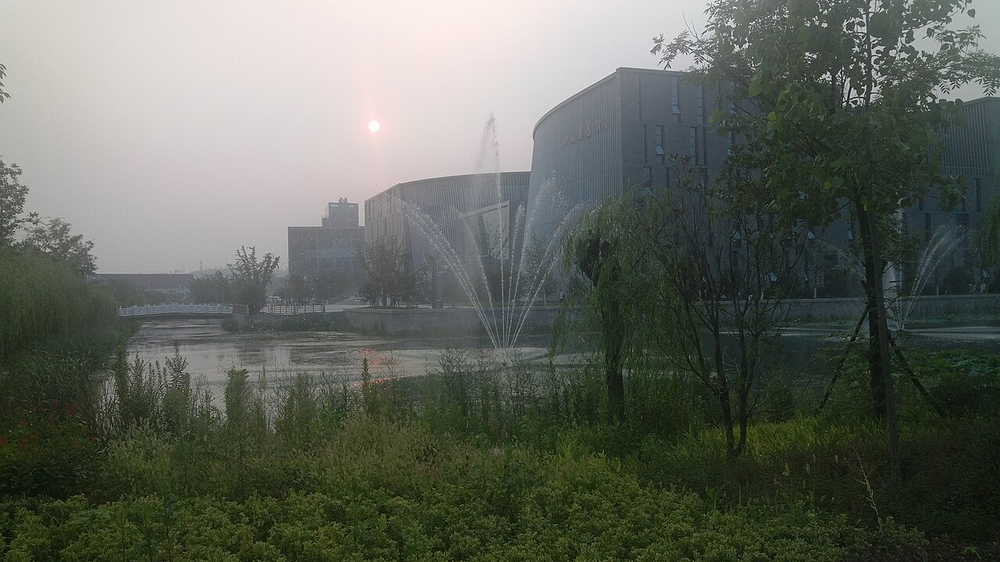

# 拔尖计划之反思

*2026-09-14 · 学习反思 · 已完成*

标签：拔尖计划 · 学习反思

## 拔尖班背景

本人是南京大学匡亚明学院23级本科生。我们本级的构成是60名高考生与30名入校二次选拔的学生。其中高考生1/4来自江苏，其余也全部来自发达省份。保研率长期在60%左右浮动，是全校最高（排除医学转段）但并没有断档，不过这并不意味着进入匡院之后就能轻松保研，至少对我来说，竞争的压力一直存在。

*南京大学仙林校区图书馆前的夕照（2012 年）。摄影：李凡其（Li3939108），[Wikimedia Commons](https://commons.wikimedia.org/wiki/File:Duxia_Library_in_NJU_Xianlin_Campus.jpg)，[CC BY-SA 3.0](https://creativecommons.org/licenses/by-sa/3.0/)。使用缩略版本，未作其他修改。*

## 培养方案分析

从培养方案的角度来讲，一个比较大的问题在于：匡院培养方案的本意是<mark style="color:blue;">数理化生天文计算机自由选择</mark>，但是由于培养方案的差异，不得不使得我们必须从大一上开始抉择。

最典型的例子是《问题求解》。这门课是离散数学、数据结构、算法分析的综合体，属于是教育改革的尝试，但是实际上，这门课与计算机拔尖班的同学一起上，而老师是算法竞赛教练，于是课程的进度对于0基础的人（暑假尝试配置 VS Code 中的 C++失败，再无别的动作）来讲，这门课实在是*天书中的天书*。

问题在于，如果要分流进入计算机方向，那么必修这门课，否则只能进入其他方向；这把选方向的难题抛给了大一新生，实际上看<mark style="color:orange;">只是把决策机会延后了两个月</mark>，而这两个月中并没有什么更多的信息获取。

对于入学前已经有计算机基础、也确定了方向的同学，这套安排更容易适应。但他们仍然需要在大学物理、化学等基础课程上投入不少时间，这些课程对既定专业目标的帮助，未必能让他们有直接的感受。对于基础不足、还想探索计算机的同学，课程门槛又可能让这个选项在刚开学时就变得难以选择。而对于我们这些其他方向的同学来说的话，实际上刚开学的选择就已经少了一个方向。

好在学院还有脑科学与人工智能方向，培养方案中没有《问题求解》，最终也会发计算机科学与技术专业的毕业证。这确实保留了另一条路径。不过，不同方向的选择空间有多大，终究还要看具体的课程要求。

这会引出培养方案的另外一个问题：即不同专业的人在一起培养，最后用完全不同的课程去计算学分绩与排名。即使各个老师知道匡院的这一情况，最终多门课给分的综合还是会出现系统性偏差。

这样的偏差导致了最终的排名不能够完全准确地反映学生们对知识掌握的程度；这对于排名中部的同学无关紧要，但是对于比较靠后在保研线上竞争的同学来讲，<mark style="color:purple;">一点分差就可能影响机会</mark>，还是会有一些意见的。我暂时想不出一个更公平、又足够可行的办法。学院有它的现实困难，而站在保研线附近的学生，也确实需要承担这种不确定性。

## 就读体验分析

*下列课程表按所附六学期培养方案截图整理，保留图中的学分和类别。截图未展示课程间的替代关系与修读要求，因此不直接加总学分；课程名中的省略号表示原图未显示完整名称。*

### 大一：补齐基础

至少对我这样基础并不齐全的学生来说，匡院大一的课程绝对算不上轻松。微积分比理工科专业要难一个层次，接近数学星层次数学分析。在此也是特别感谢范红军老师，能够尽量从零基础的角度来讲解大部分的问题。当然，这对于当时的我还是有一定的难度。

除此之外，由于我本人在高中阶段没有上过生物课，而通修方案中包括了大学生物学与化学实验基础，这对于想修脑科学的人来讲还是造成了比较大的压力，我不得不花费很多时间来补齐这些基础。





| 课程名称 | 学分 | 类别 |
| --- | ---: | :---: |
| 微积分 I（第一层次） | 5.0 | 通修 |
| 数学分析 | 5.0 | 通修 |
| 高等代数 | 4.0 | 通修 |
| 线性代数（第一层次） | 4.0 | 通修 |
| 大学英语（一） | 4.0 | 通修 |
| 思想道德与法治 | 3.0 | 通修 |
| 大学生物学 | 3.0 | 平台 |
| 程序设计基础 | 3.0 | 通修 |
| 化学实验基础 | 2.0 | 平台 |
| 体育（一） | 1.0 | 通修 |
| 形势与政策 | 0.25 | 通修 |

*来源：[第一学期培养方案截图](images/semester-1.png)。*





| 课程名称 | 学分 | 类别 |
| --- | ---: | :---: |
| 大学物理实验（一） | 2.0 | 平台 |
| 大学物理（上） | 4.0 | 平台 |
| 人工智能程序设计 | 4.0 | 平台 |
| 形势与政策 | 0.25 | 通修 |
| 马克思主义基本原理 | 3.0 | 通修 |
| 微积分 II（第一层次） | 5.0 | 通修 |
| 数学分析 | 5.0 | 通修 |
| 高等代数 | 4.0 | 通修 |
| 军事理论 | 2.0 | 通修 |
| 程序设计基础 | 3.0 | 通修 |
| 大学英语（二） | 4.0 | 通修 |
| 体育（二） | 1.0 | 通修 |
| 数字逻辑与计算机组成 | 4.0 | 选修 |
| 程序设计基础实验 | 2.0 | 选修 |
| 名师导学 | 2.0 | 选修 |
| 化学合成与表征 II | 3.0 | 选修 |

*来源：[第二学期培养方案截图](images/semester-2.png)。*





### 大二：课程与进组同时推进

来到大二，由于大学物理和计算机系统基础（ICS）的存在，大部分CS与AI的同学绩点都遭受了重击。而与此同时，CS和AI学院在组织进组的双选会。匡院毕竟没有对口的计算机方向导师，在进组这方面还是得自己想办法；而在这个过程中，由于别院导师还是更喜欢收尖子生，这还是导致了中部以及后段同学进组困难：课程学习已经需要投入大量时间，寻找科研机会又需要额外花精力，这两件事还往往发生在同一个阶段。





| 课程名称 | 学分 | 类别 |
| --- | ---: | :---: |
| 计算机系统基础 | 5.0 | 核心 |
| 人工智能导论 | 2.0 | 核心 |
| 学术与科创能力培养 | 1.0 | 核心 |
| 理论力学 | 4.0 | 核心 |
| 大学物理（下） | 4.0 | 平台 |
| 中国近现代史纲要 | 3.0 | 通修 |
| 形势与政策 | 0.25 | 通修 |
| 习近平新时代中国特色… | 2.0 | 通修 |
| 体育（三） | 1.0 | 通修 |
| 大学物理实验（二） | 2.0 | 选修 |
| 化学合成与表征 III | 3.0 | 选修 |
| 高级英语词汇 | 2.0 | 选修 |
| 实用英语写作 | 2.0 | 选修 |

*来源：[第三学期培养方案截图](images/semester-3.png)。*





| 课程名称 | 学分 | 类别 |
| --- | ---: | :---: |
| 操作系统 | 4.0 | 核心 |
| 生理学 | 3.0 | 核心 |
| 计算方法 | 2.0 | 核心 |
| 学术与科创能力培养 | 1.0 | 核心 |
| 近代应用数学 | 3.0 | 平台 |
| 概率论与数理统计 | 3.0 | 平台 |
| 形势与政策 | 0.25 | 通修 |
| 体育（四） | 1.0 | 通修 |
| 毛泽东思想和中国特色… | 2.0 | 通修 |
| 脑科学相关医学影像学 | 2.0 | 选修 |
| 实验心理学（上） | 2.0 | 选修 |
| 数理逻辑 | 3.0 | 选修 |
| 博弈论及其应用 | 2.0 | 选修 |
| 生物化学实验 | 1.0 | 选修 |

*来源：[第四学期培养方案截图](images/semester-4.png)。*





### 大三：自己寻找信息

大三，跟同学们交流下来，最大的问题还是信息闭塞；不仅仅是进组，包括外校的冬令营项目，春令营套磁等等，都更多需要自己的信息收集能力；这是一种锻炼，但在这种时间点上更多的是压力。





| 课程名称 | 学分 | 类别 |
| --- | ---: | :---: |
| 生物化学与分子生物学 | 2.0 | 核心 |
| 学术与科创能力培养 | 1.0 | 核心 |
| 神经网络 | 2.0 | 核心 |
| 理论力学 | 4.0 | 核心 |
| 毛泽东思想和中国特色… | 1.0 | 通修 |
| 形势与政策 | 0.25 | 通修 |
| 习近平新时代中国特色… | 1.0 | 通修 |
| 复杂体系分子模拟导论 | 3.0 | 选修 |
| 计算材料学 | 3.0 | 选修 |
| 学术论文写作 | 2.0 | 选修 |
| 模态逻辑与模态认识论 | 2.0 | 选修 |
| 实验心理学（下） | 2.0 | 选修 |
| 认知心理学 | 3.0 | 选修 |
| 运筹学 | 4.0 | 选修 |
| 数字图像处理 | 2.0 | 选修 |

*来源：[第五学期培养方案截图](images/semester-5.png)。*





| 课程名称 | 学分 | 类别 |
| --- | ---: | :---: |
| 神经生物学 | 2.0 | 核心 |
| 生物信息与计算生物学 | 3.0 | 核心 |
| 数据挖掘导论 | 2.0 | 核心 |
| 学术与科创能力培养 | 1.0 | 核心 |
| 形势与政策 | 0.25 | 通修 |
| 生理学实验 | 1.0 | 选修 |
| 生物色谱质谱 | 2.0 | 选修 |
| 系统生物学导论 | 2.0 | 选修 |
| 大数据分析 | 2.0 | 选修 |
| 机器学习导论 | 2.0 | 选修 |
| 数学建模 | 2.0 | 选修 |
| 组合数学 | 3.0 | 选修 |
| 多元统计分析 | 4.0 | 选修 |
| 分子生物学实验 | 1.0 | 选修 |
| 实变函数与泛函分析 | 4.0 | 选修 |

*来源：[第六学期培养方案截图](images/semester-6.png)。*





从大一到大三，这些问题其实是连在一起的：选择方向需要自己判断，缺少的基础需要自己补，科研机会需要自己找，升学信息也需要自己搜集。学院给了我们选择的空间，而把这些选择变成现实，需要学生有很强的主动性，也需要投入不少额外的时间。

*在课程、科研与未来方向之间，慢慢作出自己的选择。（AI 情境插画，非作者实拍或真实校园还原。）*

<mark style="color:green;">但我仍然很感激学院。</mark>对于拿到保研资格的同学，学院会尽力帮助大家找到不错的去处。在现有资源条件下，能够保持这样的升学支持，离不开各位教授、行政人员和辅导员的努力。

## 总结

> 综合来讲，我似乎想下这样的暴论：**<mark style="color:purple;">“拔尖计划更适合不拔尖的人”</mark>**。

对于成绩中上游、希望去外校争取更好机会的同学来说，他们明明已经在这样激烈的竞争中抢占先机，可能已经花了很多力气，但这并不意味着自己同时拥有了足够有竞争力的科研经历。课程成绩需要维持，科研需要时间，他们用于科研的时间被激烈的排名竞争所挤占，而这种内卷却并未让外面的学院能够无条件放行我们。

对于希望安稳留在本校的同学，情况可能有所不同。如果已经比较有把握拿到保研资格，也不打算继续争取更高的排名或外校机会，就可能减少这部分投入，把时间留给项目、科研，甚至单纯的玩。当然，这一切的<mark style="color:orange;">前提是保研资格相对稳妥</mark>；对于仍在保研线上竞争的人，留本校同样不轻松。

因此，同一套培养方案，<mark style="color:blue;">对不同目标的人，价值可能差得很远</mark>。每个试图进入拔尖计划的同学，都值得在“拔尖”这个名字之外，多看一眼实际的课程、科研资源和升学支持。相对于原来的大班，我可能获得什么，又需要为此付出什么？我最想得到的，是升学的确定性、探索方向的空间，还是尽早在一个领域积累成果？

这些问题没有统一的答案。但*想清楚自己究竟想从大学里得到什么*，应该比进入一个听起来更好的培养计划更重要。

谢谢你读到这里。如果这篇帖子能够对你有一点帮助，我荣幸之至。

[全部文章](../README.md)
