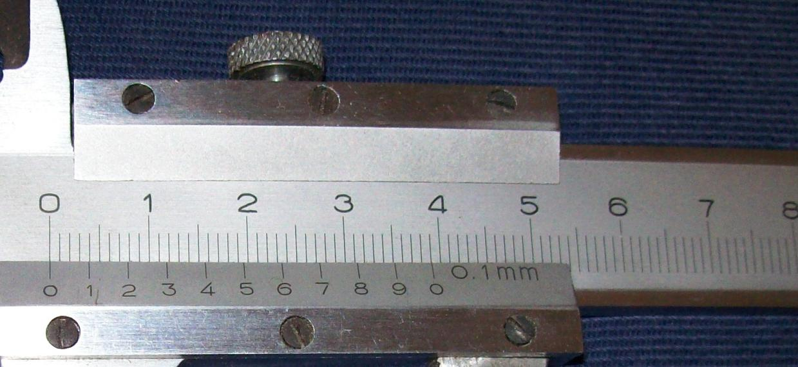

# 校准对人工智能助手的信任

可信交互不是让人尽可能相信系统，而是帮助人对具体输出形成恰当依赖。

2026-08-24 · 研究札记 · 阅读约 4 分钟 · 示例

标签：人机交互 · 信任 · 负责任的人工智能

[全部文章](./)

> **示例文章。** 本文是为示例站点撰写的概念性设计札记，不代表已经部署的系统、完成的用户研究或作者本人的研究成果。


*在依赖一个建议之前，先看看它的依据。（AI 情境插画）*

## 信任不是一个开关

当人们询问人工智能系统是否值得信任时，问题听起来像是非黑即白。实际使用中，信任却随任务变化：系统整理列表时可能相当可靠，概括陌生论文时也许有帮助但会出错，而面对高影响决策时，它不应成为唯一依据。

所以，设计目标不该是“让用户更信任人工智能”，而应是帮助用户在特定时刻，对特定输出给予恰当程度的信任。信任不足会浪费有价值的辅助；信任过度则会让错误藏在流畅表达之后。所谓校准，正发生在这两种失败之间。

这一思路延续了“用计算机增强人的推理，而非简单取代人”的传统；当代人机交互准则则进一步强调设定正确预期、支持纠正，并让辅助方式随使用情境调整 (Amershi et al., 2019; Licklider, 1960)。自动化研究也持续区分恰当使用、误用与弃用 (Lee & See, 2004; Parasuraman & Riley, 1997)。真正需要观察的单位并非孤立的模型，而是人在持续使用中与系统共同形成的关系。

## 让不确定性能够指导行动

单独一个百分比很少能告诉人下一步该做什么。“置信度 82%”看起来十分科学，却可能没有说明估计如何产生、关键证据是否缺失，或一旦出错会造成多大代价。有用的不确定性表达必须同时连接后果与行动。

界面可以根据决策影响和输出的不确定性选择辅助模式：

```ts
type DecisionContext = {
  impact: "low" | "medium" | "high";
  uncertainty: "low" | "medium" | "high";
};

export function assistanceMode(context: DecisionContext) {
  if (context.impact === "high" || context.uncertainty === "high") {
    return {
      mode: "verify",
      showSources: true,
      inviteAlternatives: true,
      message: "请把它视为草稿；行动前先核查证据。",
    };
  }

  return {
    mode: "assist",
    showSources: false,
    inviteAlternatives: false,
    message: "你可以继续、修改，或查看这项结果如何产生。",
  };
}
```

这段代码并非普适的信任公式，它只是表达一个产品原则：风险或不确定性任一上升时，界面都应提高核验支持的强度。同时，用户必须能够检查并推翻系统对情境的判断。



*借用测量作比喻：恰当的信任需要可检查的依据，也需要认识精度的边界。摄影：Ulfbastel，[Wikimedia Commons](https://commons.wikimedia.org/wiki/File:Messschieber2.jpg)，[公有领域](https://commons.wikimedia.org/wiki/File:Messschieber2.jpg#Licensing)。原图未修改。*

## 信任也在修复中形成

准确率固然重要，但一次交互是否值得信赖，也取决于错误发生之后。系统会不会承认纠正？用户能否看出哪些部分被修改？它是否一边声称已经学习，一边重复同样的问题？

良好的修复机制会让错误变得可读。它保留原建议，清楚展示修订，并说明本次纠正的适用范围，而不是暗示修好一次就能保证未来可靠。这样，用户才拥有可以随时间积累和评估的证据。

校准并不是新手引导里出现一次的警告，而是一种持续节奏：预期、行动、反馈、修复。界面通过让能力可观察、让边界可遭遇，逐渐形成恰当的依赖。最好的结果既不是用户永远接受，也不是永远怀疑，而是他知道何时可以快速前进，何时应该检查，又在何时必须停下来。

## 参考文献

Amershi, S., Weld, D., Vorvoreanu, M., Fourney, A., Nushi, B., Collisson, P., Suh, J., Iqbal, S., Bennett, P. N., Inkpen, K., Teevan, J., Kikin-Gil, R., & Horvitz, E. (2019). Guidelines for Human-AI Interaction. Proceedings of the 2019 CHI Conference on Human Factors in Computing Systems, 1–13. [https://doi.org/10.1145/3290605.3300233](https://doi.org/10.1145/3290605.3300233)

Lee, J. D., & See, K. A. (2004). Trust in Automation: Designing for Appropriate Reliance. Human Factors: The Journal of the Human Factors and Ergonomics Society, 46(1), 50–80. [https://doi.org/10.1518/hfes.46.1.50\_30392](https://doi.org/10.1518/hfes.46.1.50_30392)

Licklider, J. C. R. (1960). Man-Computer Symbiosis. IRE Transactions on Human Factors in Electronics, HFE-1(1), 4–11. [https://doi.org/10.1109/THFE2.1960.4503259](https://doi.org/10.1109/THFE2.1960.4503259)

Parasuraman, R., & Riley, V. (1997). Humans and Automation: Use, Misuse, Disuse, Abuse. Human Factors: The Journal of the Human Factors and Ergonomics Society, 39(2), 230–253. [https://doi.org/10.1518/001872097778543886](https://doi.org/10.1518/001872097778543886)
