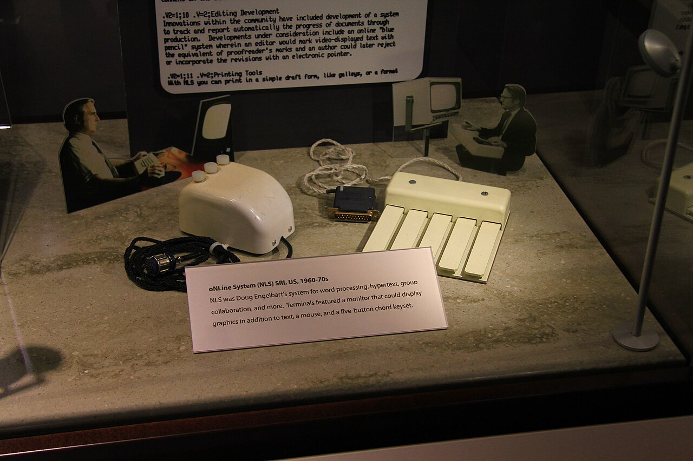

# 作为认识伙伴的界面

界面不只传递答案，也塑造什么可以被追问、检查与修正。

2026-09-03 · 研究札记 · 阅读约 4 分钟 · 示例

标签：人机交互 · 界面设计 · 知识工作

[全部文章](./)

> **示例文章。** 本文仅用于展示博客的研究写作形式，提出一种设计立场；不代表作者已经发表相关成果，也不暗示任何机构归属或已完成的实证研究。

*让问题保持开放，也让判断可以修正。（AI 情境插画）*

## 不只是答案的容器

界面常被理解为一层中性的表面：人提出问题，系统给出回答，屏幕只负责传递结果。然而，界面同时决定什么容易被询问、什么会持续可见，以及不确定性何时出现。它不仅塑造行动，也参与塑造人对事情的判断。

设想一个人工智能助手只给出一段流畅、完整的文字，却不呈现其他解释、隐含假设或尚未解决的证据。即使每句话都正确，界面仍然做出了认识论选择：它把知识表现成已经尘埃落定。另一个界面则可能并列两种解释，邀请用户检查来源，或追问“什么证据会改变当前结论”。底层模型可以完全相同，但它们所支持的思考方式并不相同。

因此，把界面称为“认识伙伴”，并不是赋予它智慧或人格，而是承认交互设计参与了人如何形成、检验与修正信念的过程[^1]。 混合主动系统与人机交互的研究，也为这种伙伴关系提供了更长的设计脉络 (Amershi et al., 2019; Horvitz, 1999)。

## 辅助的三种姿态

可以用一个简单区分来观察界面：它是在关闭问题、装饰答案，还是重新打开探究？

| 界面姿态  | 主要优化目标 | 常见风险   | 更有帮助的回应   |
| ----- | ------ | ------ | --------- |
| 答案机器  | 速度与完成  | 过早确定   | 说明假设与边界   |
| 置信度展示 | 安心感    | 虚假的精确  | 将置信度连接到证据 |
| 认识伙伴  | 修正与探究  | 增加认知负担 | 给出下一个好问题  |

第三种姿态并不意味着处处增加摩擦。计算器仍应迅速给出结果，普通措辞建议也未必需要长篇解释。关键是把思考成本放在“出错后果真正重要”的位置。若一项建议可能改变研究方向，界面就应提供来源、备选解释与可验证路径。

我们可以把反思需求简写为 $$D = u \times i$$，其中 $$u$$ 表示不确定性，$$i$$ 表示决策影响。它们不必成为产品里真实显示的分数；这个式子只是提醒设计者：不确定性越高、后果越重大，解释与核验越有价值。

$$
\text{支持深度} \propto
\text{不确定性} \times
\text{决策影响}
$$

*NLS 的三键鼠标与和弦键盘：界面也可以是桌面上一组参与思考的工具。摄影：Michael Hicks，经 [Wikimedia Commons](https://commons.wikimedia.org/wiki/File:ON-Line_System_%28NLS%29,_SRI_%281960-1970s%29_-_three-button_mouse_and_chord_keyboard_-_Computer_History_Museum.jpg)，[CC BY 2.0](https://creativecommons.org/licenses/by/2.0/)。使用等比例缩略图，未改动画面内容。*

## 设计一个可修正的循环

认识伙伴式界面应让“修改判断”显得正常，而不是像承认失败。它可以先给出暂定答案，再区分观察与推断，保留用户曾经排除的方案，并提出一个小小的反事实问题：什么证据能够证明这项建议是错的？

仅仅增加解释并不足够。冗长的理由有时只会制造一种更令人信服的过度自信。更好的界面会提供可以实际检查的对象：一条来源、一个有争议的前提、一个模式之外的例子，或两种合理解读之间的比较。

目标并非让人永远怀疑，而是把怀疑放在合适的位置：足以维持探究，又不把每次交互都变成审计。真正有价值的认识伙伴不只留下一个答案，也留下问题的地图、不确定性的轮廓，以及用户下一步能够采取的行动。

## 参考文献

Amershi, S., Weld, D., Vorvoreanu, M., Fourney, A., Nushi, B., Collisson, P., Suh, J., Iqbal, S., Bennett, P. N., Inkpen, K., Teevan, J., Kikin-Gil, R., & Horvitz, E. (2019). Guidelines for Human-AI Interaction. Proceedings of the 2019 CHI Conference on Human Factors in Computing Systems, 1–13. [https://doi.org/10.1145/3290605.3300233](https://doi.org/10.1145/3290605.3300233)

Horvitz, E. (1999). Principles of Mixed-Initiative User Interfaces. Proceedings of the SIGCHI Conference on Human Factors in Computing Systems, 159–166. [https://doi.org/10.1145/302979.303030](https://doi.org/10.1145/302979.303030)

[^1]: 此处“认识”讨论的是知识如何形成与获得理由，并不声称界面具有与人相同的理解能力。
